

  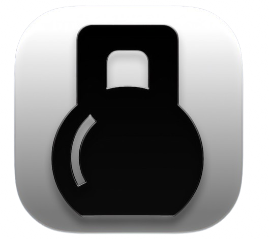
  <h1>Workout</h1>
  
<strong>Track a client's strength, reps, and endurance progress over time — at a glance.</strong>

Workout is a SwiftUI app for iOS 27 that turns a client's raw workout history into clear, glanceable progress. It surfaces every exercise the client has performed, lets a coach set per-exercise goals, and visualises progress toward those goals with circular gauges and time-series charts across multiple time ranges — with full accessibility support and end-to-end test coverage.

**NOTE:**
Tests will fail on GitHub until they add Xcode 27 with iOS 27 support to their runners. They pass locally with the latest Xcode 27 beta. Since I'm not shipping this app, I'll leave the project as is until GitHub updates their test runner OSes.

## Screenshots

| Exercise list | No goals set | Edit goals |
| :---: | :---: | :---: |
| 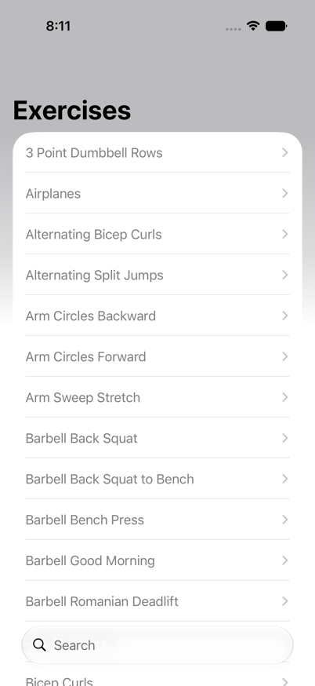 | 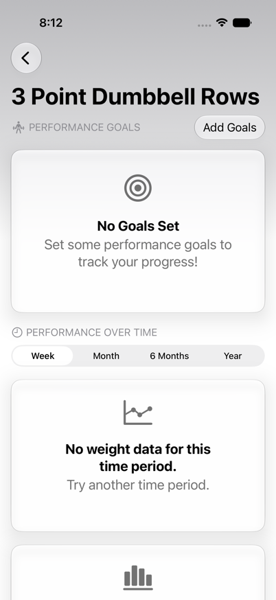 | 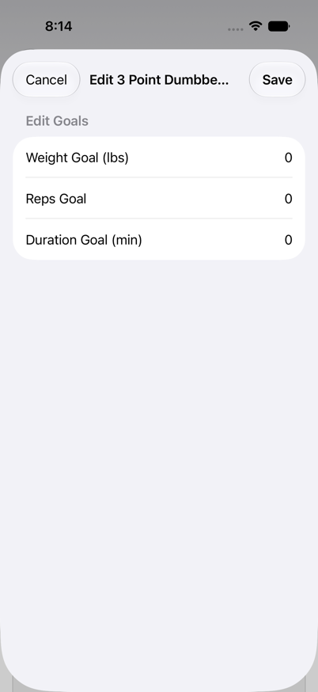 |

| Goal gauges | Progress charts | Empty chart state |
| :---: | :---: | :---: |
| 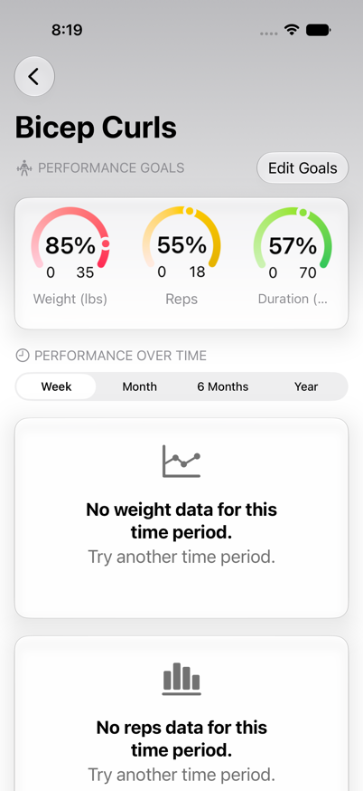 | 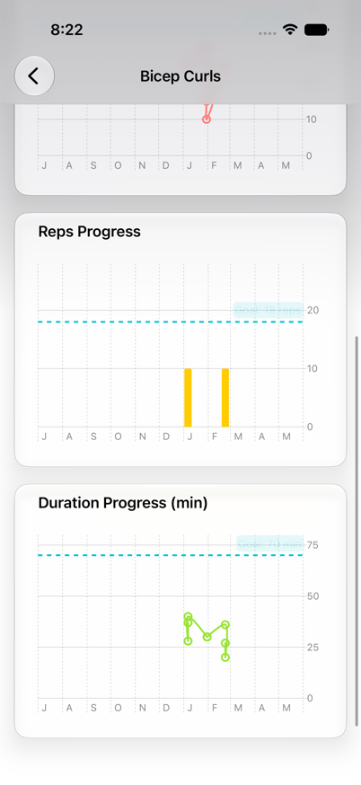 | 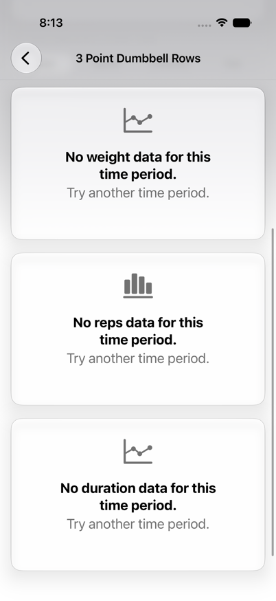 |

Dark mode

| Exercise list | No goals set | Edit goals |
| :---: | :---: | :---: |
| 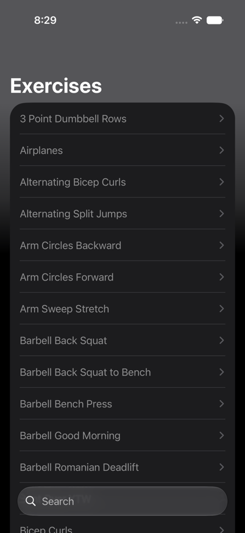 | 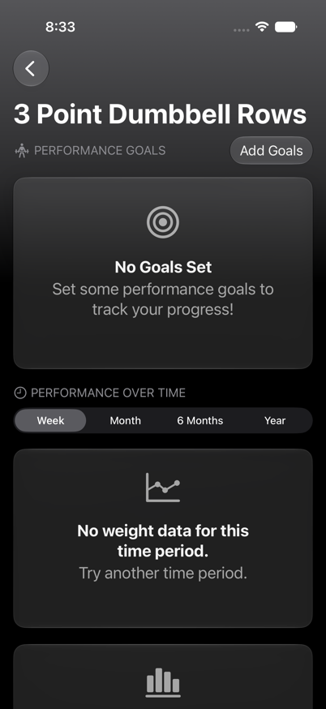 | 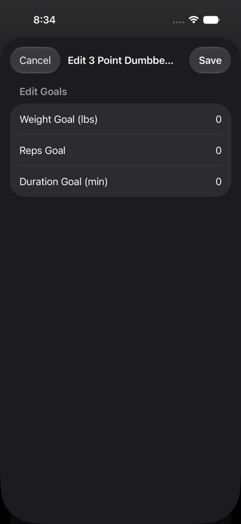 |

| Goal gauges | Progress charts | Empty chart state |
| :---: | :---: | :---: |
| 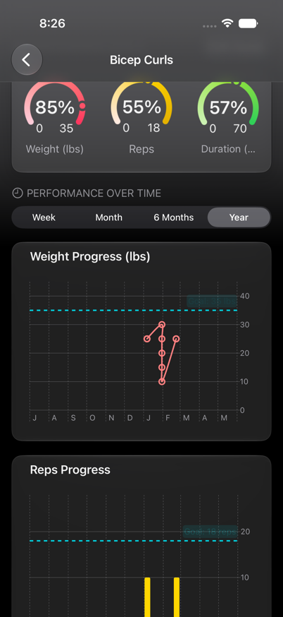 | 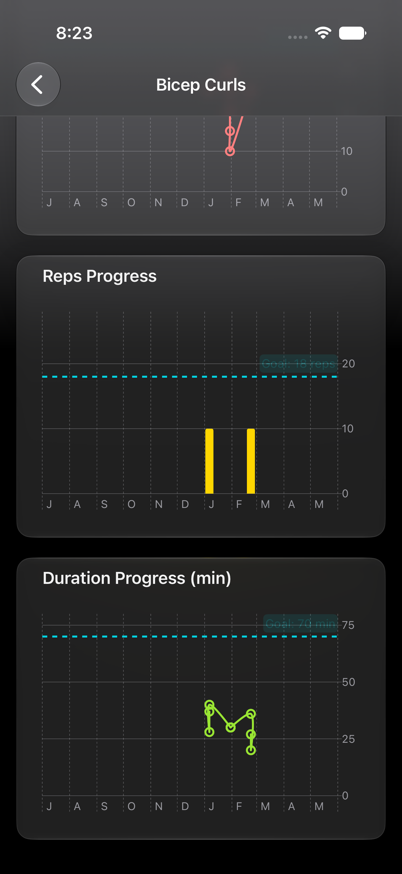 | 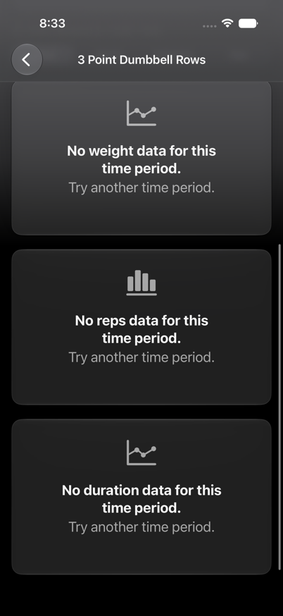 |

## Key Features

- **Exercise catalogue** — a searchable, alphabetically sorted list of every exercise the client has performed, derived from their workout history.
- **Performance goals** — set weight, reps, and duration goals per exercise. Progress toward each goal is shown with a circular gauge, so a coach can see at a glance how close the client is.
- **Progress charts** — weight, reps, and duration plotted over time with a dashed goal reference line, across Week / Month / 6 Months / Year ranges.
- **Glanceable empty states** — clear, friendly states when an exercise has no goals set or no data in the selected time range, plus dedicated loading and load-failure states.
- **Liquid Glass UI** — cards and controls use the iOS 27 Liquid Glass material, with full light and dark mode support.
- **Persistent goals** — goals are saved with SwiftData and restored on relaunch.
- **Full VoiceOver support** — gauges announce their metric and percent-complete, charts summarise their range and goal, and decorative icons are hidden from assistive technologies.
- **Dynamic Type** — text uses semantic styles and is exercised at accessibility content sizes in both previews and UI tests.
- **Centralized accessibility identifiers** — a single source of truth shared (by a thin mirror) with the UI test target.
- **Code quality enforcement** through SwiftLint.
- **Comprehensive test coverage** — unit + UI + accessibility tests, run in CI.

## Technologies

- Swift 6 (language mode, complete strict concurrency)
- SwiftUI
- SwiftData (local persistence)
- Swift Charts
- Swift Testing framework (unit tests)
- XCTest + XCUIAutomation (UI & accessibility tests)
- Async/Await
- iOS 27 minimum OS target

## Data Source

The app ships with a set of anonymised workout summaries as bundled JSON resources under `Workout/Data/summaries`. Each file is one completed workout containing the set-by-set summaries a client generated during a session. Keeping the catalogue as discrete JSON documents — rather than a single blob — mirrors how a real per-workout export would arrive and makes it trivial to add, remove, or fix a workout without touching code. The data is loaded and decoded off the main thread at launch.

## Architecture & Design Patterns

- MVVM with a clear split between a concurrency-agnostic domain core and a `@MainActor` UI layer
- Dependency injection through protocols (`WorkoutDataLoading`, `GoalStoreProtocol`)
- Protocol-oriented design so every collaborator is mockable in tests
- Repository-style data access through `WorkoutRepository`
- Pure, deterministic domain logic that takes the current date/calendar as parameters
- Single source of truth for accessibility identifiers (`AccessibilityIdentifiers`)

| Layer | Responsibility | Key types |
| :--- | :--- | :--- |
| **Models** | `Codable`, `Sendable` value types decoded from the workout JSON | `WorkoutSummary`, `ExerciseSetSummary`, `ExerciseSet`, `Exercise` |
| **Domain logic** | Pure, deterministic functions for all progress math | `ExerciseAggregation`, `TimeWindow`, `ChartData`, `GoalProgress`, `ProgressMetric` |
| **Data** | Loads workout summaries asynchronously, off the main thread | `WorkoutDataLoading`, `BundleWorkoutLoader`, `WorkoutRepository` |
| **Persistence** | Stores per-exercise goals behind a protocol | `ExerciseGoal` (SwiftData `@Model`), `GoalStoreProtocol`, `GoalStore` |
| **View models** | Observable state and presentation logic | `ExerciseListViewModel`, `ExerciseDetailViewModel` |
| **Views** | SwiftUI screens and reusable components | `ExerciseListView`, `ExerciseDetailView`, `ProgressChart`, `GoalGaugeSection`, `GlassCard` |

### Focus Areas

1. **Domain core (pure & deterministic)**
   - Aggregation, time-window filtering, chart-series building, and goal math live in pure functions that take `now`/`calendar` as parameters, so they're fully deterministic and unit-tested without a running app.
   - All domain types are `Sendable`, making them safe to hand across the actor boundary from the background loader to the `@MainActor` UI.

2. **SwiftUI implementation**
   - Composable views with private computed sub-views (`mainScrollView`, `performanceOverTimeSection`, `progressCharts`) rather than monolithic bodies.
   - **One chart, not three** — a single reusable `ProgressChart` renders the weight, reps, and duration series, replacing what used to be three near-identical chart files.
   - Multiple preview configurations per view: light, dark, empty/no-data, and accessibility text sizes.
   - iOS 27 Liquid Glass material via a reusable `glassCard()` modifier.

3. **Concurrency (Swift 6)**
   - Builds in the Swift 6 language mode with `SWIFT_STRICT_CONCURRENCY=complete`.
   - The domain core is nonisolated; view models, the repository, and the goal store are `@MainActor`.
   - Workout JSON is read and decoded inside a `Task.detached`; the UI shows a loading state and never blocks.

4. **Persistence & dependency injection**
   - `GoalStore` is the single place that touches a SwiftData `ModelContext`.
   - It sits behind `GoalStoreProtocol`, so `ExerciseDetailViewModel` can be tested against an in-memory `MockGoalStore` with no SwiftData stack — mirroring how `WorkoutRepository` is tested against a `MockWorkoutDataLoading`.

5. **Error & state handling**
   - A typed `WorkoutDataError` drives a user-facing `ContentUnavailableView` on load failure.
   - `WorkoutRepository` models the load lifecycle explicitly (`idle → loading → loaded / failed`) and allows retry after failure without getting stuck in a loading state.

6. **Accessibility**
   - Every interactive element has an accessibility identifier sourced from `AccessibilityIdentifiers`.
   - Gauges are exposed as a single VoiceOver element that announces, e.g., *"Weight (lbs) goal, 120 of 200, 60 percent complete."*
   - Charts carry a spoken summary of their range and goal line; section-header icons are marked decorative.
   - Dynamic Type is verified in previews and a UI test that launches at `AccessibilityXL`.

## Testing

- **64 automated tests, all passing locally.**
- **Unit tests** use the [Swift Testing](https://developer.apple.com/documentation/testing/) framework (`@Test` / `#expect`), organised by feature:
  - `ModelDecodingTests` — hand-written `Codable` conformances against the bundled JSON shape
  - `ExerciseAggregationTests`, `TimeWindowTests`, `ChartDataTests`, `GoalProgressTests` — the deterministic domain core
  - `ExerciseListViewModelTests`, `ExerciseDetailViewModelTests` — search, goal state machine, progress math, chart series (via `MockGoalStore`)
  - `WorkoutRepositoryTests` — load lifecycle, idempotency, and retry-after-failure (via `MockWorkoutDataLoading`)
  - `BundleWorkoutLoaderTests` — bundled-resource loading and the `noDataFound` path
  - `GoalStoreTests` — SwiftData persistence against an in-memory store
  - `StringDateConversionTests`, `StringExtensionTests` — date parsing fallbacks and helpers
- **UI tests** (XCUITest) launch the app with `--uitesting`, which swaps the persistent goal store for an in-memory one so each run starts clean and network-/state-independent:
  - `WorkoutUITests` — list rendering, search filtering, add-goal flow, cancel flow
  - `WorkoutAccessibilityUITests` — VoiceOver labels on rows and fields, and a launch at accessibility Dynamic Type size
- A **test plan** (`Workout.xctestplan`) keeps unit tests parallel (fast) and UI tests sequential (reliable). CoreData/SwiftData suites use `.serialized` so parallel container initialisation can't race.

## Continuous Integration

Tests run automatically on GitHub Actions for every push to `main` and every pull request targeting `main`. The workflow lives at [`.github/workflows/tests.yml`](.github/workflows/tests.yml): one job lints with SwiftLint, the other runs the **unit tests** (`-only-testing:WorkoutTests`) via `xcodebuild test` against an iOS Simulator destination on a `macos-latest` runner and uploads the `.xcresult` bundle as an artifact. The UI tests are kept out of CI — they're slower and simulator-bound — and are run locally from the full test plan.

## Time Spent

- 40% on the domain core, data modeling, and protocol/DI boundaries
- 30% on SwiftUI views, view models, charts, and previews
- 20% on testing (unit + UI), accessibility wiring, and CI
- 10% on documentation and polish

## Trade-offs and Decisions

- **SwiftData over CoreData** for goal persistence: goals are a tiny, single-entity store, and SwiftData's `@Model` keeps the persistence layer to a few lines while still giving a clean migration story if the schema grows.
- **Bundled JSON over a network call**: the focus of this piece is data modeling, progress math, and visualisation, so the workout history ships in-app. The source is abstracted behind `WorkoutDataLoading`, so swapping in a networked loader later requires no changes to the repository or UI.
- **`connect(to:)` injection for the goal store** rather than constructor injection: a SwiftData `ModelContext` is only available from the SwiftUI environment inside the view body, so the view model receives its `GoalStoreProtocol` in `.task`. The protocol still makes the view model fully unit-testable with a mock.
- **Mirror copy of accessibility identifiers** in the UI test target: UI test targets can't use `@testable import`, so a thin mirror is the pragmatic alternative to a shared package.
- **Date passed in, never read internally** across the domain core: every time-based function takes `now`/`calendar`, trading a little verbosity for fully deterministic, time-zone-independent tests.

## License

Released under the [MIT License](LICENSE). © 2026 SarahUniverse
